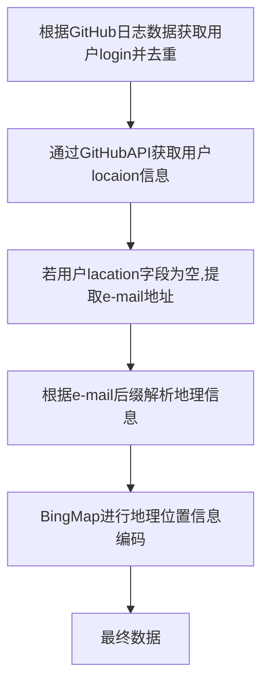

# GitHub用户全球时空分布可视化

# 一 团队介绍

我们团队来自湖北大学OS-HUB组织。我们汇集了来自不同背景和领域的优秀成员，包括软件开发、数据分析和可视化设计等方面的优秀学生。我们希望通过数据分析和可视化的方式，为开源社区的发展做出贡献。

我们的团队非常注重合作和协作。我们有良好的沟通和团队合作能力，能够有效地分工合作、解决问题和完成任务。具体分工如下：

**罗丽（队长）**：数据处理、总体设计

裴国强：数据提取、数据集建立

夏宇春：数据库设计、数据接口开发

周开成：前端页面开发

# 二 作品介绍

本项目旨在通过可视化大屏展示全球GitHub用户在各国家地区的分布情况和随时间的变化趋势，帮助管理员和运营团队更好地了解和管理开源社区的用户，并反映全球各地区的开源趋势。通过统计各个国家开发者人数随时间的变化情况和各国开发者人数的排名，还可以深入了解全球开源社区的生态，以及不同国家地区之间开源生态的发展趋势，为技术人才的交流和合作提供支持和帮助。项目将通过世界地图和表格的形式展示数据，直观地呈现开源生态的发展历程。

## 2.1 背景及意义

目前，全世界现在有90%的企业都在使用开源软件，在2022年， GitHub平台用户已经增长到9,400万 ，GitHub上总共收到4.13亿次的开源贡献。 开源已经成为一个大趋势。所以我们有必要对开源的种种现象进行相应的研究，从而去发现开源的一些规律，让开源社区、开源贡献者以及想要进行开源贡献的人对开源趋势能有一个更清晰的认识。我们希望在数据分析的基础上，通过可视化大屏展示数据背后的一些信息：

- 开发者生态系统：GitHub 是全球范围内最流行的开源代码托管平台之一，拥有数千万的开发者用户，通过展示全球 GitHub 用户的分布情况，我们可以更好地了解全球开发者的生态系统，这对于研究和推动全球技术发展具有重要意义。

- 开源社区的多样性：开源社区在全球范围内有着广泛的影响力，通过展示 GitHub 用户在不同国家和地区的分布情况，我们可以更好地了解全球开源社区的多样性，可能包括不同地区的文化、语言、技术偏好等方面，这对于促进不同地区的交流与合作具有重要作用。

- 促进技术人才交流与合作：通过展示全球 GitHub 用户的分布情况，我们可以了解全球技术人才的分布和规模，这对于促进全球技术人才的交流和合作具有很大的意义，有助于搭建全球化的技术合作平台，推动全球技术创新和进步。

- 推动技术发展：通过展示全球 GitHub 用户的分布情况，我们可以发现技术发展的热点和趋势，进而为企业、政府、投资者等人群提供技术方向和战略建议，有助于推动全球技术发展，提高全球技术水平。

## 2.2 总体目标

- 本项目目标是通过一个可视化大屏展示GitHub用户在全球各个国家地区的分布情况，以及用户数量和分布随时间的变化趋势。通过此平台，管理员和运营团队可以更好地了解和管理开源社区的用户，同时反映全球各地区的开源趋势。此外，通过统计各个国家开发者人数随时间的变化情况和各国开发者人数的排名，我们还可以深入了解全球开源社区的生态，以及不同国家地区之间开源生态的发展趋势，为技术人才的交流和合作提供支持和帮助。

- 在可视化方面，我们将通过一个大屏展示世界地图来呈现开发者的地理信息。这样一来，用户可以直观地了解GitHub用户在全球范围内的分布情况，并进一步了解各个国家的开发者数量。在时间尺度上，我们将筛选自2008年至2022年期间的所有具有地理位置信息的GitHub用户，并根据他们加入GitHub社区的时间统计不同时间段加入社区的人数。通过以表格形式展示GitHub用户数量的变化情况，我们能够反映出从2015年至2022年开源生态的发展趋势。为了更好地展示全球各个国家地区的开源生态发展情况，我们将时间数据和空间数据结合在一起，动态地在地图上展示不同时间段内全球GitHub开发者的数量及其分布情况。

## 2.3 数据集建立

由于ClickHouse数据库中原始日志数据中并不直接包含GitHub用户的地理位置信息，这让想针对地理位置信息进行研究的人很难下手。因此我们需要利用现有的日志数据，建立包含用户地理位置信息的数据集。大致流程如下：从原始信息中获取用户的login，通过login获取位置相关信息，最后对位置信息进行解析。

### 2.3.1 原始数据

原始数据取自ClickHouse数据库中2015-2022年GitHub所有用户的的日志数据，其中包含了2015-2022年开发者所有的行为数据。由于数据量过于庞大，本项目只利用了其中的5300万条。

### 2.3.2 GitHub用户数据的地理标签化处理

（1）通过GitHub日志数据，获取到GitHub用户用户名，并进行去重操作

（2）通过GitHub提供的API，根据用户的login去获取用户信息，并提取用户的location字段信息

（3）若用户lacation字段为空，则提取email信息并根据后缀进行解析，对位置信息进行扩充

（4）利用BingMap API将提取到的lacation信息转换成标准的地理位置编码

### 2.3.3 数据集形成

（基本单位：条）

| 初始日志数据 | 初始用户数据 | 用户location字段非空的数据 | 通过e-mail进行扩充的数据 | 最终数据    |
|:------:|:------:|:-----------------:|:---------------:|:-------:|
| 5300w  | 300w   | 677,696           | 13,899          | 691,595 |

**初始日志数据**：2015年-2022年GitHub的日志数据

**初始用户数据**：对原始数据进行处理后，获取到的2008-2022年注册的GitHub用户基本信息数据

**包含地理位置的数据**：原始数据中含有地理位置信息的用户数据（用户location字段不为空的数据）

**扩充的数据**：通过email解析后增加的含有地理信息的数据

**最终数据**：通过用户location字段和e-mail信息解析之后获得的有效数据

## 2.4 可视化设计

### 2.4.1 GitHub用户全球分布及热点

**功能描述**：本模块旨在通过可视化展示GitHub用户在全球各地的分布情况，并提供多种地图样式和交互方式，如缩放、点击和悬停等简单的交互。

（**1**）全球用户分布：初始状态下，通过气泡图在世界地图上展示GitHub用户在各个国家的分布情况。气泡的颜色代表该国家的GitHub开发者人数，气泡颜色越深表示该国家的开发者人数越多。

（**2**）各国GitHub用户数展示：当鼠标悬停在某一地区时，会弹出一个小气泡，显示当前鼠标悬停位置的国家名称以及该国家的GitHub用户数量。

（**3**）单个国家GitHub用户分布展示：地图支持省（州）级别的展示。当用户双击地图中的某个国家时，该国家的地图板块将被放大并高亮显示，并展示该国家各省（州）级别的GitHub用户分布情况。

（**4**）单个国家各地区用户数量统计：当地图图层变化至单个国家时，鼠标悬停在该国某个具体省（州）区域，会通过气泡图展示该地区的用户总数。

### 2.4.2 GitHub用户全球增长趋势

**功能描述**：本模块旨在统计自2015年至2022年期间GitHub开发者数量的变化，并以折线图的形式展示GitHub开发者数量随时间的趋势。

（**1**）GitHub全球总用户数量变化：通过折线图展示2008年至2022年期间全球GitHub开发者数量的变化趋势。

（**2**）通过在地图下方设置具有刻度的时间轴，以年为单位（2008-2022），可以动态展示用户数量的变化。时间轴上配备滑块，用于确定地图上展示的特定年份的数据。此外，还提供了播放按钮，可通过点击开始动态展示2008年至2022年期间全球GitHub用户数量的变化。用户可以随时通过滑块来查看特定时间点的数据。同时，用户可以点击暂停按钮以暂停播放，并展示从2008年到暂停时刻的用户增长数据。此外，用户还可以在时间轴上点击其他位置，滑块将随之跳转，并展示当前时刻的数据。

（**3**）单个国家GitHub用户数量变化：当选择特定国家时，该模块的数据将切换为该国家GitHub用户数量随时间的变化趋势。

### 2.4.3 GitHub用户国家及地区分布规模

**功能描述**：本模块旨在统计每个国家的GitHub开发者数量，并按照数量从高到低进行排名，展示地区名称和开发者数量。

（**1**）全球开发者用户排行榜：通过横向柱状图统计各个国家的GitHub用户数量，并在柱状图上显示该国家的GitHub用户数量。

### 2.4.4 近15年GitHub用户全球时空发展过程重演

为了更好地展示全球GitHub用户的演变过程，我们将前面三个模块进行联动。

（**1**）当点击时间轴时，地图上的气泡图会随着时间轴的变化而变化。随着时间的增长，GitHub的用户数量也在逐渐增加，通过改变地图上气泡的大小来表示GitHub用户数量的变化。

（**2**）在时间轴下方的折线图中展示全球GitHub用户数量随时间的变化情况。通过折线图可以直观地看出全球GitHub用户数量的增长趋势。在地图上展示出各个国家GitHub用户数量的增长情况，并进行国家之间的比较。

（**3**）用户可以通过模块之间的切换按钮自由切换不同的展示模式，以满足不同的数据分析需求。

总体而言，通过以上的可视化设计，用户可以直观地了解全球GitHub用户的地理分布、用户数量随时间的变化以及各个国家的开发者数量排名，从而深入了解GitHub社区的全球发展情况。同时，各模块之间的联动可以提供更加全面的数据分析和对比功能，帮助用户发现有趣的趋势和洞察社区的发展动态

## 2.5 成果展示

**大屏访问地址**：<http://111.47.28.118:30013/#/>

**演示视频地址**：<>

# 三 比赛收获

参加此次开源可视化比赛是一个锻炼和提升技术能力的机会。在项目开发过程中，我们将面临各种技术挑战，例如数据处理、可视化设计、大屏展示等。通过解决这些挑战，我们能够不断学习和掌握新的技术知识、工具和方法，提升我们的技术水平。

本次比赛中，我们队伍成员之间分工合作，结合自己擅长的领域，分别从不同的方向来完善我们的解决方案，我们以较高的效率共同推进，充分发挥了团队的合作精神。
